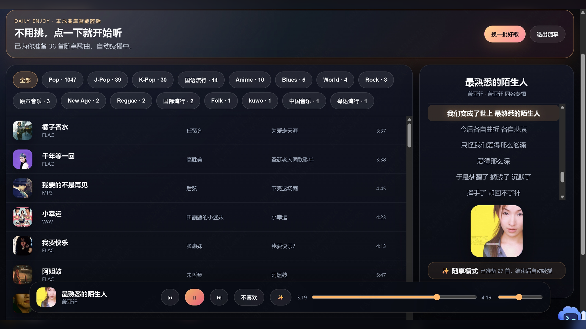

# Fung-song Plus

> 飞牛 NAS + Navidrome 的轻量音乐门户 / Navidrome Plus 风格前端与 API 中台。

**作者：峰Sir / hello-fengsir**  
**版权声明：未经授权禁止商用、转载、去署名、二次售卖或改名发布。**

Fung-song Plus 面向家庭 NAS 与私有音乐库场景，提供更适合大屏、桌面和移动端的音乐门户体验：搜索、分类、歌词、封面、后端代理串流、沉浸式大屏播放，以及“随享模式”本地曲库智能随播。

## 预览截图




## 核心能力

- 🎵 **Navidrome / Subsonic 适配**：通过后端 API 聚合歌曲、分类、封面、歌词与播放地址。
- 🔐 **后端代理串流**：前端不直接暴露上游音乐服务账号、密码或签名 URL。
- 🖥️ **沉浸式大屏播放**：模糊封面背景、暖色氛围、歌词高亮、旋转唱片视觉与底部控制栏。
- ✨ **随享模式**：基于本地曲库生成推荐队列，不用挑歌也能连续播放。
- 📱 **响应式体验**：兼顾桌面、移动端和 NAS 内网页面访问。
- 🧩 **Docker 部署**：提供 `docker-compose.example.yml` 和 `.env.example`，便于私有化部署。

## 快速开始

```bash
cp .env.example .env
# 编辑 .env，填写你的 Navidrome 地址、账号、密码和本地音乐目录

docker compose -f docker-compose.example.yml --env-file .env up -d --build
```

访问：

```text
http://your-server-ip:8892
```

## 开发运行

### Frontend

```bash
cd frontend
npm ci
npm run dev
```

### Backend

```bash
cd backend
python -m venv .venv
source .venv/bin/activate
pip install -r requirements.txt
uvicorn app.main:app --host 0.0.0.0 --port 8000
```

## 配置项

| 变量 | 说明 |
| --- | --- |
| `NAVIDROME_BASE` | Navidrome / Subsonic 服务地址 |
| `NAVIDROME_USER` | 音乐服务用户名 |
| `NAVIDROME_PASSWORD` | 音乐服务密码 |
| `NAVIDROME_CLIENT` | Subsonic client 标识 |
| `MUSIC_ROOTS` | 容器内音乐目录，多个目录用逗号分隔 |
| `MUSIC_ROOT_PATH` | 宿主机音乐目录挂载路径 |

## 赞赏 / Support

如果这个项目对你有帮助，欢迎赞赏支持作者继续优化。

<p>
  
</p>

> 支付宝赞赏码暂未放入仓库；如需展示，可将图片保存为 `docs/sponsor/alipay.png` 后在 README 中追加展示。

## 安全说明

- 不要提交 `.env`、真实 `docker-compose.yml`、NAS 路径、内网地址、账号、密码或 API Key。
- 本仓库只保留 `docker-compose.example.yml` 与 `.env.example` 占位配置。
- 如果你曾把真实密码提交到远端，请立即更换上游服务密码。

## License

Source-available / All rights reserved. See [LICENSE](LICENSE).
